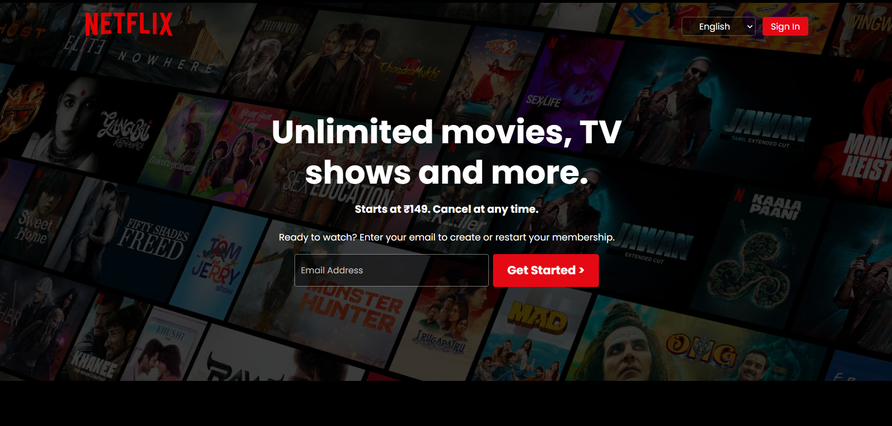
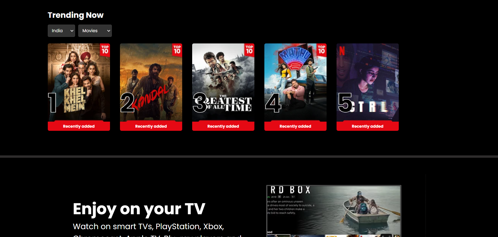
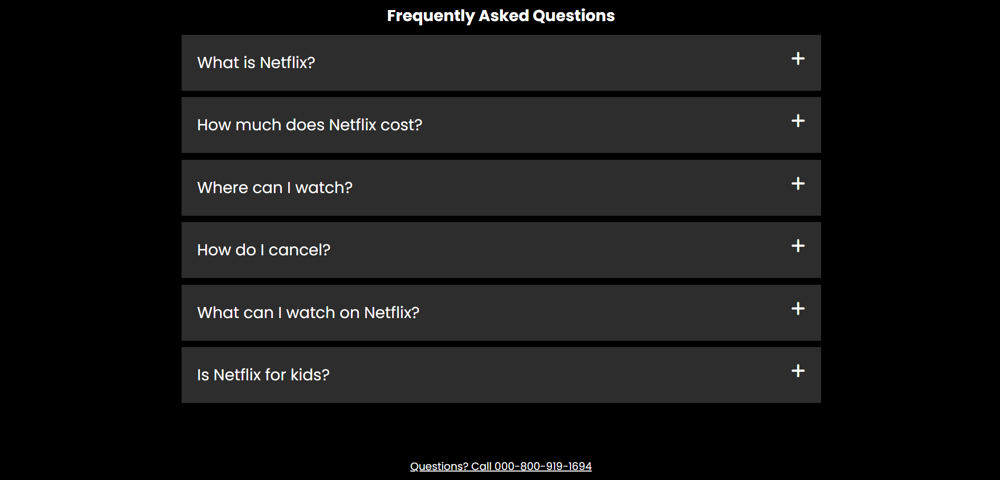

# Netflix UI Clone

A front-end clone of Netflix India's homepage, featuring a visually engaging layout with a hero section, trending movies, FAQs, and footer. Built with HTML and CSS, this project demonstrates skills in UI design, layout styling.

## Features

- **Hero Section**: Includes sign-in options, language selection, and a call-to-action to start a membership.
- **Trending Now**: A carousel-style trending section showcasing popular content, with options to filter by region and type (Movies/TV Shows).
- **Content Sections**: Highlights Netflix’s features like watching on any device, offline downloads, and profiles for kids.
- **FAQ Section**: An interactive FAQ to address common user questions about Netflix.
- **Footer**: Quick links to additional resources like Help Center, Account, and Privacy settings.

## Technologies Used

- **HTML**: Structure of the webpage.
- **CSS**: Styling and layout.

## Installation and Usage

1. **Clone the repository**:
   ```bash
   git clone https://github.com/Saishhhhhh/Netflix-Clone.git

2. **Navigate to the project folder   
   ```bash
   cd Netflix-Clone

## Screenshots

Here are some screenshots of the project:

  
*Hero Section*


*Trending Now Section*


*FAQ Section*

